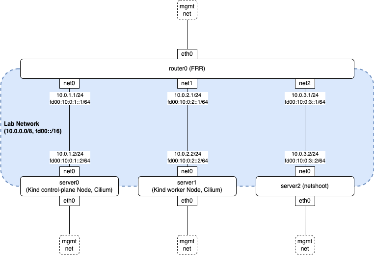

.. only:: not (epub or latex or html)

    WARNING: You are looking at unreleased Cilium documentation.
    Please use the official rendered version released here:
    https://docs.cilium.io

.. _bgp_cplane_contributing:

=================
BGP Control Plane
=================

This section is specific to :ref:`bgp_control_plane` contributions.

Development Environment
=======================

BGP Control Plane requires a BGP peer for testing. This section describes a `ContainerLab`_ and `Kind`_-based development environment. The following diagram shows the topology:

.. _ContainerLab: https://containerlab.dev/
.. _Kind: https://kind.sigs.k8s.io/

The following describes the role of each node:

* ``router0`` is an `FRRouting (FRR)`_ router. It is pre-configured with minimal peering settings with server0 and server1.
* ``server0`` and ``server1`` are ``nicolaka/netshoot`` containers that each share a network namespace with their own Kind node.
* ``server2`` is a non-Cilium ``nicolaka/netshoot`` node useful for testing traffic connectivity from outside of the k8s cluster.

.. _FRRouting (FRR): https://frrouting.org/

Prerequisites
-------------

* ContainerLab v0.45.1 or later
* Kind v0.20.0 or later
* Your container runtime networks must not use ``10.0.0.0/8`` and ``fd00::/16``

Deploy Lab
----------

The following example deploys a lab with the latest stable version of Cilium:

.. code-block:: shell-session

   $ make kind-bgp-service

.. note::
        The prior example sets up an environment showcasing k8s service advertisements over BGP. Please refer to container lab directory in Cilium repository under ``contrib/containerlab`` for more labs.

If you want to install a locally built version of Cilium instead of the stable version, pass ``local`` as the ``VERSION`` environment variable value:

.. code-block:: shell-session

   $ make VERSION=local kind-bgp-service

Peering with Router
-------------------

Peer Cilium nodes with FRR by applying BGP configuration resources:

.. code-block:: shell-session

   $ make kind-bgp-service-apply-bgp

To deploy some example k8s services, run the following commands:

.. code-block:: shell-session

   $ make kind-bgp-service-apply-service

Validating Peering Status
-------------------------

You can validate the peering status with the following command. Confirm that
the session state is established and Received and Advertised counters are non-zero.

.. code-block:: shell-session

   $ cilium bgp peers
   Node                                   Local AS   Peer AS   Peer Address   Session State   Uptime   Family         Received   Advertised
   bgp-cplane-dev-service-control-plane   65001      65000     fd00:10::1     established     51s      ipv4/unicast   6          4
                                                                                                       ipv6/unicast   4          3
   bgp-cplane-dev-service-worker          65001      65000     fd00:10::1     established     51s      ipv4/unicast   6          6
                                                                                                       ipv6/unicast   4          4

Destroy Lab
-----------

.. code-block:: shell-session

   $ make kind-bgp-service-down

Concurrency Guidelines
======================

The BGP Control Plane uses multiple concurrent goroutines for reconciliation and state management. When contributing to the BGP codebase, follow these concurrency guidelines:

Operator-Side Concurrency
-------------------------

The ``operator/pkg/bgp`` package runs multiple concurrent jobs (6 by default) that trigger reconciliation. When accessing shared state:

* **Always protect maps and shared state with mutexes**. Example: ``bgpRouterIDMap`` uses ``bgpRouterIDMapMu`` (RWMutex) to prevent data races during concurrent router ID allocation.
* Use ``RLock/RUnlock`` for read operations and ``Lock/Unlock`` for write operations.
* Test concurrent scenarios with the race detector: ``go test -race ./operator/pkg/bgp``

Agent-Side Concurrency
----------------------

The ``pkg/bgp`` package maintains the following lock ordering invariant:

.. code-block:: go

   // Lock ordering invariant: pendingInstancesMutex -> BGPRouterManager.Lock
   // If both locks need to be taken, acquire pendingInstancesMutex first.

**Always follow this ordering** to prevent deadlocks. If unsure about lock ordering in new code, consult existing patterns in ``pkg/bgp/manager/manager.go``.

State Tracking Goroutines
--------------------------

State tracking goroutines monitor BGP instance state changes. When launching goroutines:

* Use contexts for lifecycle management
* Add panic recovery to prevent crashes
* Ensure proper cleanup on initialization failure

Testing Concurrent Code
-----------------------

* Add concurrency tests for any code that accesses shared state
* Run tests with race detector: ``go test -race``
* Stress test with multiple nodes and instances (see ``TestRouterIDAllocationConcurrency`` for an example)
